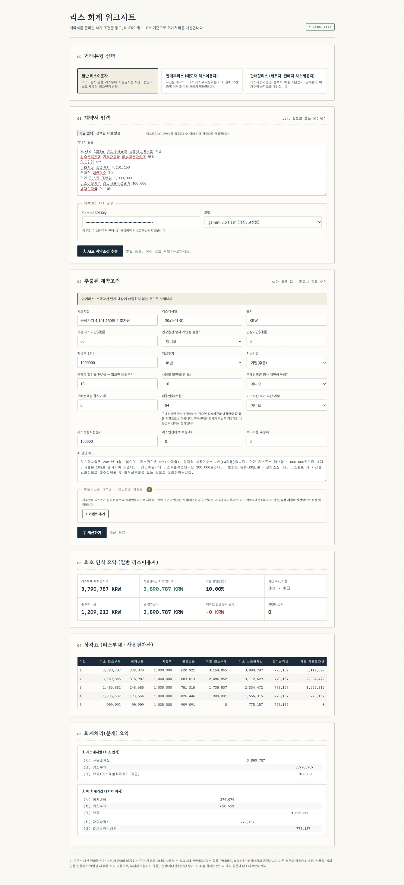
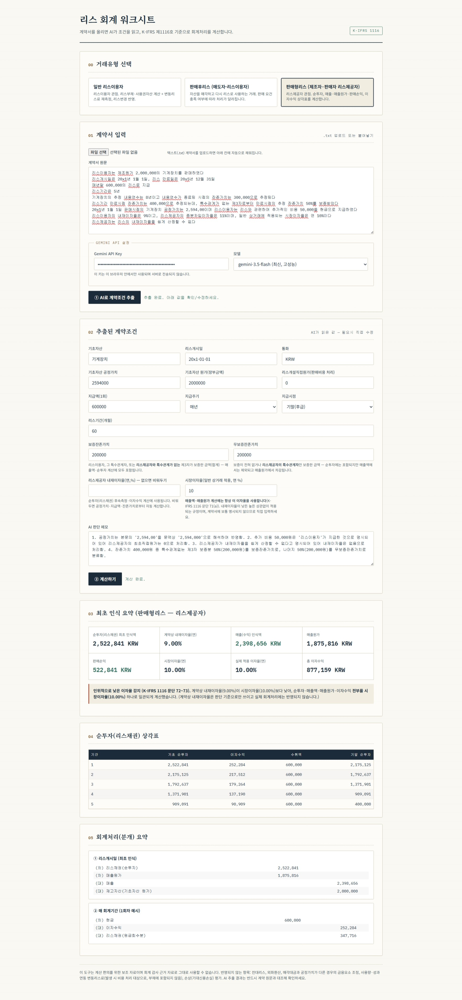

# 리스 계산기 (K-IFRS 1116)

리스 계약서(텍스트)를 업로드하면 Gemini API가 계약 조건을 읽어 구조화된 값으로
추출하고, K-IFRS 제1116호(리스) 기준에 따른 회계처리 — 리스부채·사용권자산·
리스채권·매출·매출원가 — 를 계산해주는 단일 HTML 웹앱입니다. 서버, 빌드 과정
없이 브라우저에서 파일을 열기만 하면 바로 동작합니다.

## 설계 원칙: "AI는 조건만 추출하고, 계산은 코드가 한다"

이 프로젝트의 핵심 설계 결정은 **AI(Gemini)가 절대 회계 수치를 직접 계산하지
않는다**는 점입니다.

- **AI가 하는 일**: 계약서 원문(자연어)에서 리스기간, 지급액, 할인율, 잔존가치
  보증 여부 같은 항목을 구조화된 JSON으로 추출. 계약서에 명시되지 않은 항목은
  추측하지 않고 그대로 비워두거나 `notes` 필드에 판단이 필요한 이유를 남김.
- **코드가 하는 일**: 현재가치 계산, 유효이자율법 상각, 감가상각, 매출/매출원가
  산정 등은 전부 고정된 결정론적 자바스크립트 함수가 계산. 여러 기간에 걸친
  복리 계산은 LLM이 오히려 자릿수 오차·계산 누락을 일으키기 쉬운 영역이라
  판단했습니다.

## 지원 거래유형

| 유형 | 설명 |
|---|---|
| **일반 리스이용자** | 리스부채·사용권자산 계산 + 변동리스료 재측정(지수연동) + 리스변경(범위축소/조건변경) 이벤트 반영 |
| **판매후리스** (매도자-리스이용자) | 판매 요건 충족 여부에 따라 매각 처리(보유비율만큼 사용권자산 인식) 또는 금융약정 처리(자산 보유, 금융부채 인식)로 분기 |
| **판매형리스** (제조자·판매자 리스제공자) | 순투자(리스채권)·매출액·매출원가·판매손익 계산. 잔존가치 보증 주체(리스이용자/제3자/리스제공자 특수관계자)에 따른 처리, 인위적으로 낮은 이자율 감지 시 시장이자율로 전환하는 로직 포함 |

## 사용 방법

1. 저장소를 클론하거나 `lease_worksheet.html` 파일만 내려받습니다 (의존성 설치
   불필요).
2. 브라우저에서 파일을 엽니다.
3. **거래유형**을 선택합니다.
4. 리스 계약서 `.txt` 파일을 업로드하거나 원문을 직접 붙여넣습니다.
5. [Google AI Studio](https://aistudio.google.com/apikey)에서 발급받은 Gemini
   API 키를 입력합니다. (코드 상단 `DEFAULT_API_KEY` 상수에 직접 넣어두면 매번
   입력하지 않아도 됩니다. 개인/로컬 용도로만 이 방식을 권장합니다 — 브라우저에
   그대로 노출되므로 공유 환경에서는 사용하지 마세요.)
6. **① AI로 계약조건 추출** → 추출된 값을 원문과 대조해 확인/수정 →
   **② 계산하기**를 누르면 요약, 상각표, 분개까지 한 번에 출력됩니다.

## 사용 기술

- HTML5 / CSS3 (변수 기반 테마, Grid·Flexbox 레이아웃)
- Vanilla JavaScript (프레임워크 없음, 단일 파일)
- Google Gemini API (`generateContent`, `responseSchema`를 이용한 구조화 출력)

## 검증 방법

리스회계는 소수점 단위까지 정확해야 하는 영역이라, 다음 두 가지 방식으로
반복 검증했습니다.

1. **수기 계산 대조**: 실제 회계 문제(예: 판매형리스 매출액/매출원가 계산)의
   손계산 결과와 앱의 계산 결과를 직접 비교.
2. **자체 검증 로직 내장**: 계산 함수 안에 분개의 차변 합계와 대변 합계가
   실제로 일치하는지, 상각표가 정확히 0(또는 잔존가치)으로 끝나는지를 자동으로
   확인하는 코드(`console.warn`)를 넣어, 코드를 수정할 때마다 회귀를 바로 잡을
   수 있게 했습니다.

## 한계

- 사용량·성과 연동 변동리스료는 리스부채에 포함하지 않고 발생 시점 비용
  처리 대상으로만 간주합니다 (자동 계산 대상 아님).
- 판매후리스에서 매각대금이 공정가치와 다를 경우의 추가 금융요소/선급리스료
  조정(K-IFRS 1116 문단 101)은 자동 반영되지 않고 경고만 표시됩니다.
- 전대리스(sub-lease), 외화환산은 아직 지원하지 않습니다.
- 리스제공자의 금융리스/운용리스 분류 판단(문단 61~66) 자체는 자동화되어
  있지 않으며, 사용자가 이미 거래유형을 판단했다고 가정합니다.

  
  
